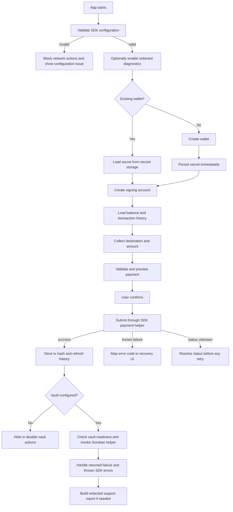
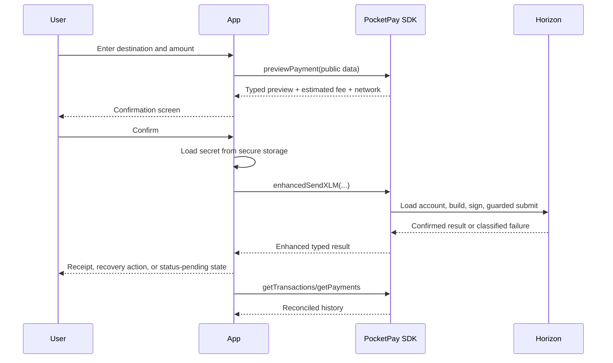

# SDK End-to-End App Integration Blueprint

This guide shows how a mobile or third-party application can combine the
PocketPay SDK's configuration, diagnostics, wallet, account, payment,
transaction, Soroban, vault, and error modules into one safe application flow.

It is an application-level blueprint rather than a replacement for the
module-specific API reference. Use it to decide **when** each SDK capability
belongs in the lifecycle, what state your app should own, and where security and
recovery decisions must be made.

A runnable companion is available at
[`examples/app-integration-blueprint.ts`](../examples/app-integration-blueprint.ts).

> [!IMPORTANT]
> PocketPay SDK is currently Testnet-focused and has not been audited or hardened
> for Mainnet production use. Treat this blueprint as an integration pattern,
> not a security audit or a promise that every referenced network or contract is
> production-ready.

## Contents

- [1. Public package boundary](#1-public-package-boundary)
- [2. Recommended application layers](#2-recommended-application-layers)
- [3. End-to-end lifecycle](#3-end-to-end-lifecycle)
- [4. Bootstrap configuration safely](#4-bootstrap-configuration-safely)
- [5. Enable diagnostics only when needed](#5-enable-diagnostics-only-when-needed)
- [6. Create or restore a wallet](#6-create-or-restore-a-wallet)
- [7. Attach account capabilities](#7-attach-account-capabilities)
- [8. Load balances and history](#8-load-balances-and-history)
- [9. Preview, confirm, and submit a payment](#9-preview-confirm-and-submit-a-payment)
- [10. Handle transaction uncertainty safely](#10-handle-transaction-uncertainty-safely)
- [11. Integrate Soroban and vault operations](#11-integrate-soroban-and-vault-operations)
- [12. Map errors to app behaviour](#12-map-errors-to-app-behaviour)
- [13. Mobile and third-party integration boundaries](#13-mobile-and-third-party-integration-boundaries)
- [14. Production-readiness checklist](#14-production-readiness-checklist)

## 1. Public package boundary

Consumers must import from the package root:

```ts
import {
  createWallet,
  createLocalAccount,
  previewPayment,
  enhancedSendXLM,
  getTransactions,
  getVaultBalance,
  PocketPayError,
  validatePocketPayConfig,
} from 'stellar-pocketpay-sdk';
```

Do not import internal source paths such as
`stellar-pocketpay-sdk/src/payments` or `stellar-pocketpay-sdk/wallet`.
Internal module layout may change without preserving those paths.

Examples inside this repository import from `../src` so they can run directly
against a checkout. They still use only exports exposed by `src/index.ts`, the
same public package boundary published consumers receive.

## 2. Recommended application layers

Keep SDK calls behind a small application service instead of calling them
directly from every screen or route.

```text
UI / API route
    |
    v
Application service
    |- validates app state and user intent
    |- loads secrets from secure storage only when required
    |- calls PocketPay public exports
    |- maps typed results to UI-safe states
    |
    v
PocketPay SDK package root
    |- config + diagnostics
    |- wallet + account capability
    |- payments + transaction lifecycle
    |- Horizon reads
    |- Soroban + vault
    |
    v
Horizon / Friendbot / Soroban RPC / deployed contract
```

A useful host-application state model separates public identity from secret
material:

```ts
interface WalletSession {
  publicKey: string;
  network: 'testnet' | 'mainnet';
  canSign: boolean;
}

interface SecretStore {
  saveWalletSecret(publicKey: string, secretKey: string): Promise<void>;
  loadWalletSecret(publicKey: string): Promise<string | null>;
  deleteWalletSecret(publicKey: string): Promise<void>;
}
```

The `WalletSession` can be used by UI state, analytics, and read-only queries.
The `SecretStore` belongs behind an OS keychain, Android Keystore, encrypted
browser storage, an HSM, or another security-reviewed boundary. Never put the
secret key in Redux, URL parameters, logs, crash reports, or ordinary async
storage.

## 3. End-to-end lifecycle



Recommended ownership:

| Concern | SDK owns | Host application owns |
| --- | --- | --- |
| Keypair generation and import | Key derivation and format validation | Backup, encrypted persistence, recovery UX, device security |
| Network configuration | Resolution and validation | Environment selection, endpoint trust, deployment policy |
| Payment construction and submission | Validation, build, sign, guarded submit | User confirmation, limits, policy checks, status presentation |
| Transaction history | Typed Horizon mapping and pagination | Caching, display, reconciliation with business records |
| Vault calls | Parameter validation, simulation, submission, result mapping | Contract deployment trust, contract ID governance, product semantics |
| Errors | Typed error codes and safe metadata | User copy, retry policy, escalation, support workflow |
| Diagnostics | Redacted events and report generation | Whether/where diagnostics are enabled and retained |

## 4. Bootstrap configuration safely

Validate configuration before rendering payment or vault actions. The
non-throwing `validatePocketPayConfig` API is suited to application bootstrap:

```ts
import {
  validatePocketPayConfig,
  type SDKConfig,
} from 'stellar-pocketpay-sdk';

const sdkConfig = {
  network: 'testnet',
  timeout: 30_000,
} satisfies Partial<SDKConfig>;

const validation = validatePocketPayConfig(sdkConfig);

if (!validation.valid) {
  for (const issue of validation.errors) {
    console.error(`[${issue.field}] ${issue.code}: ${issue.message}`);
  }

  throw new Error('PocketPay configuration is invalid');
}

for (const warning of validation.warnings) {
  console.warn(`[${warning.field}] ${warning.code}: ${warning.message}`);
}

const resolvedConfig = validation.config;
```

Configuration precedence is:

```text
function-level override > environment variable > SDK default
```

Keep one resolved network choice across wallet funding, Horizon reads, payment
submission, and Soroban calls. A testnet public key used with mainnet endpoints,
or a mainnet contract ID used with testnet RPC, creates confusing and potentially
unsafe behaviour.

Important configuration rules:

- `fundTestnetAccount` is Testnet-only.
- Prefer HTTPS Horizon and Soroban RPC endpoints outside local development.
- Pin or approve custom endpoints rather than accepting arbitrary URLs from UI
  input.
- Treat the vault contract ID as a deployment setting. Do not let an untrusted
  user choose the contract your app invokes.
- Vault operations require `contractId` in call parameters, `SDKConfig`, or the
  relevant environment variable.

See [Configuration](./configuration.md) for the complete precedence and
validation rules.

## 5. Enable diagnostics only when needed

Diagnostics are opt-in and disabled by default. Enable them during development
or a controlled support session:

```ts
import {
  enableDiagnostics,
  disableDiagnostics,
  buildDiagnosticsReport,
  type DiagnosticsEvent,
} from 'stellar-pocketpay-sdk';

const events: DiagnosticsEvent[] = [];

enableDiagnostics({
  hooks: {
    onEvent: (event) => {
      events.push(event);
      console.debug(
        '[pocketpay]',
        event.domain,
        event.type,
        event.data,
      );
    },
  },
});

// Run SDK operations here.

const supportReport = buildDiagnosticsReport({
  network: 'testnet',
});

// Store or attach supportReport through an approved support channel.
disableDiagnostics();
```

The SDK redacts known sensitive fields before delivering events or reports, but
the host application must still apply normal log access controls and retention
rules.

> [!CAUTION]
> Never add the secret key, seed phrase, password, signed XDR, raw transaction
> envelope, authorization header, or full request body to diagnostic context.
> Prefer transaction hashes, public keys, ledger numbers, stable event names,
> and typed error codes.

`POCKETPAY_DEBUG=true` does not by itself register an event hook. The
application must still call `enableDiagnostics` or `setDiagnosticsHooks`.

See [SDK Diagnostics](./diagnostics.md) and
[Logging: Transaction Payloads and Debug Mode](./logging-payloads-and-debug.md).

## 6. Create or restore a wallet

### New wallet

```ts
import { createWallet } from 'stellar-pocketpay-sdk';

const wallet = createWallet();

await secretStore.saveWalletSecret(
  wallet.publicKey,
  wallet.secretKey,
);

// Safe to keep in normal application state:
const publicIdentity = { publicKey: wallet.publicKey };

// Do not log wallet, wallet.secretKey, or serialized screen state.
```

`createWallet` does not activate the account on-chain and does not back up the
secret key. Persist the secret immediately before allowing the user to leave
the creation flow.

For Testnet-only development:

```ts
import { fundTestnetAccount } from 'stellar-pocketpay-sdk';

const funded = await fundTestnetAccount(wallet.publicKey, {
  network: 'testnet',
});

if (!funded.success) {
  throw new Error(funded.error ?? 'Friendbot funding failed');
}
```

Never expose Friendbot funding as a Mainnet action.

### Restored wallet

```ts
import { importWallet } from 'stellar-pocketpay-sdk';

const secretKey = await secretStore.loadWalletSecret(publicKey);

if (!secretKey) {
  throw new Error('Wallet secret is unavailable');
}

const restored = importWallet(secretKey);

if (restored.publicKey !== publicKey) {
  throw new Error('Stored wallet identity does not match');
}
```

Use `safeImportWallet` or `enhancedImportWallet` when your UI prefers a typed
result instead of an exception.

## 7. Attach account capabilities

The wallet module creates or restores key material. The account module exposes
whether the current identity can sign.

```ts
import {
  createLocalAccount,
  createReadOnlyAccount,
  canSignTransaction,
} from 'stellar-pocketpay-sdk';

const readOnly = createReadOnlyAccount(publicKey);

const secretKey = await secretStore.loadWalletSecret(publicKey);
const account = secretKey
  ? createLocalAccount(secretKey)
  : readOnly;

if (!canSignTransaction(account)) {
  // Balance and history can still work, but hide signing actions.
  showReadOnlyMode();
} else {
  enablePaymentActions();
}
```

A `ReadOnlyAccount` has `canSign: false` and cannot sign. A `SigningAccount`
contains a `Signer`, not a public raw-secret field. This distinction is useful
for watch-only wallets, hardware-wallet adapters, browser signers, and mobile
apps that unlock signing only after user authentication.

Do not treat `canSign: true` as user consent. The application must still show
the final destination, asset, amount, fee, memo, and network before requesting
or performing a signature.

## 8. Load balances and history

Use public keys for read paths. Secret keys are unnecessary and should never be
passed to balance or history functions.

```ts
import {
  getBalanceOrUnfunded,
  getTransactions,
  getPayments,
} from 'stellar-pocketpay-sdk';

const balanceResult = await getBalanceOrUnfunded(publicKey, sdkConfig);

if (balanceResult.status === 'unfunded') {
  showAccountActivationState();
} else {
  renderNativeBalance(balanceResult.balance.nativeBalance);
}

const transactionPage = await getTransactions(
  publicKey,
  { limit: 20, order: 'desc' },
  sdkConfig,
);

const paymentPage = await getPayments(
  publicKey,
  { limit: 20, order: 'desc' },
  sdkConfig,
);

renderHistory({
  transactions: transactionPage.records,
  payments: paymentPage.records,
  nextTransactionCursor: transactionPage.nextCursor,
  nextPaymentCursor: paymentPage.nextCursor,
});
```

The SDK returns stable `TransactionSummary` and `PaymentSummary` models rather
than raw Horizon payloads. Store `nextCursor` when implementing infinite scroll
or background pagination.

Refresh history after a confirmed payment. A submitted transaction hash is the
best application-level reconciliation key.

## 9. Preview, confirm, and submit a payment

A safe payment flow has distinct **input**, **preview**, **confirmation**,
**submission**, and **reconciliation** stages.



### Preview with public data

```ts
import { previewPayment } from 'stellar-pocketpay-sdk';

const preview = await previewPayment(
  {
    sourceAccount: account.publicKey,
    destination,
    amount,
    asset: { code: 'XLM' },
    memo: { type: 'text', value: 'Order 104' },
  },
  sdkConfig,
);

showConfirmation({
  source: preview.sourceAccount,
  destination: preview.destination,
  amount: preview.amount,
  asset: preview.asset.code,
  memo: preview.memo,
  memoType: preview.memoType,
  feeStroops: preview.estimatedFee,
  network: preview.network,
});
```

A preview validates the intended values but does not sign or submit anything.
The host application should also apply its own business rules, such as daily
limits, approved recipients, sanctions controls, or step-up authentication.

### Submit only after confirmation

```ts
import { enhancedSendXLM } from 'stellar-pocketpay-sdk';

const sourceSecret = await secretStore.loadWalletSecret(account.publicKey);

if (!sourceSecret) {
  throw new Error('Signing key is unavailable');
}

const result = await enhancedSendXLM(
  {
    sourceSecret,
    destination,
    amount,
    memo: { type: 'text', value: 'Order 104' },
  },
  sdkConfig,
);

if (result.ok) {
  showReceipt({
    transactionHash: result.value.hash,
    ledger: result.value.ledger,
    amount: result.value.amount,
    fee: result.value.fee,
  });

  for (const warning of result.warnings ?? []) {
    showNonBlockingWarning(warning.code, warning.message);
  }
} else {
  handlePaymentFailure(result.error, result.recoveryHints ?? []);
}
```

For issued assets, use `sendAsset`/`safeSendAsset` and keep the destination
trustline preflight enabled. See [Issued Asset Payments](./issued-asset-payments.md).

## 10. Handle transaction uncertainty safely

A timeout during transaction preparation can usually be retried. A timeout or
connection loss during or after submission is different: the transaction may
already be on-chain.

When the SDK returns or throws `TX_STATUS_UNKNOWN`:

1. Keep the transaction in a pending or unknown UI state.
2. Preserve its transaction hash when available.
3. Poll or reconcile status through the SDK transaction lifecycle APIs.
4. Do **not** immediately send the payment again.
5. Rebuild only after the lifecycle result says the prior envelope is expired or
   definitively rejected.

```ts
import {
  PocketPayError,
  describeError,
  requiresRebuild,
  isUnknownStatusError,
} from 'stellar-pocketpay-sdk';

function chooseRecovery(error: unknown): 'poll' | 'rebuild' | 'retry' | 'stop' {
  if (!(error instanceof PocketPayError)) {
    return 'stop';
  }

  if (isUnknownStatusError(error)) {
    return 'poll';
  }

  if (requiresRebuild(error)) {
    return 'rebuild';
  }

  return describeError(error.code).retryable ? 'retry' : 'stop';
}
```

The payment helpers already use guarded submission to reduce duplicate-payment
risk. Applications must not undo that protection by wrapping payment submission
in an unconditional retry loop.

See [Safe Retry Policy](./retry-policy.md) and the transaction lifecycle ADR.

## 11. Integrate Soroban and vault operations

The generic Soroban surface is available through `createContractClient`. Use it
when integrating a contract that is not covered by a dedicated SDK helper.
Declare the allowed method names and parameter encodings in one place so UI
code cannot accidentally route a read call through a state-changing path:

```ts
import { createContractClient } from 'stellar-pocketpay-sdk';

const contractClient = createContractClient({
  contractId,
  config: sdkConfig,
  methods: {
    get_balance: {
      kind: 'readOnly',
      paramTypes: { user: 'address' },
    },
  },
});

const rawBalance = await contractClient.readOnly<bigint>({
  method: 'get_balance',
  params: { user: publicKey },
  sourcePublicKey: publicKey,
});
```

Method names and schemas are contract-specific. Only call methods verified
against the deployed contract interface, and never accept an untrusted contract
ID or method name directly from UI input.

Vault features build on the same Soroban lifecycle with dedicated helpers.
They require both a trusted deployed contract and a configured contract ID.
Keep the contract ID in deployment configuration, validate it at startup, and
expose vault UI only when readiness checks pass.

```ts
import {
  describeVaultReadiness,
  getVaultBalance,
  depositToVault,
  withdrawFromVault,
} from 'stellar-pocketpay-sdk';

const readiness = describeVaultReadiness();
const depositReadiness = readiness.find(
  (entry) => entry.kind === 'deposit',
);

if (!contractId || !depositReadiness?.supported) {
  disableVaultUI(
    !contractId
      ? 'Vault contract ID is not configured'
      : depositReadiness?.description ?? 'Vault deposit is unavailable',
  );
}
```

Each vault call has two failure channels:

- expected invocation failures returned as `{ success: false, error }`;
- configuration, validation, RPC, or unexpected failures thrown as
  `PocketPayError`.

```ts
import { PocketPayError, redactError } from 'stellar-pocketpay-sdk';

try {
  const deposit = await depositToVault(
    {
      sourceSecret,
      amount: '10',
      contractId,
    },
    sdkConfig,
  );

  if (!deposit.success) {
    showVaultFailure(deposit.error ?? 'Vault deposit failed');
    return;
  }

  const balance = await getVaultBalance(
    {
      publicKey,
      contractId,
    },
    sdkConfig,
  );

  if (balance.success) {
    showVaultBalance(balance.balance ?? '0.0000000');
  }

  const withdrawal = await withdrawFromVault(
    {
      sourceSecret,
      amount: '5',
      contractId,
    },
    sdkConfig,
  );

  if (!withdrawal.success) {
    showVaultFailure(withdrawal.error ?? 'Vault withdrawal failed');
  }
} catch (error) {
  const safe = redactError(error);
  reportSafeError(safe.code, safe.safeMessage, safe.transactionHash);

  if (error instanceof PocketPayError) {
    showVaultFailure(safe.safeMessage);
  }
}
```

> [!CAUTION]
> The current savings-vault contract is internal bookkeeping and does not move
> real XLM or SAC tokens into or out of contract custody. Do not describe a
> successful SDK deposit as real asset custody. Confirm the deployed contract's
> implementation and audit status before designing a user-facing financial
> product around it.

Soroban simulations and raw RPC responses may contain complex payloads. Prefer
the stable SDK result types and never log signed XDR or raw submission bodies.

See [Soroban Vault](./soroban-vault.md) for the current contract mapping and
limitations.

## 12. Map errors to app behaviour

Branch on `PocketPayError.code`, not the wording of `error.message`.

```ts
import {
  PocketPayError,
  describeError,
  redactError,
  type RecoveryHint,
} from 'stellar-pocketpay-sdk';

function handlePaymentFailure(
  error: PocketPayError,
  hints: RecoveryHint[],
): void {
  const description = describeError(error.code);
  const safe = redactError(error);

  logger.error('PocketPay operation failed', {
    code: safe.code,
    category: safe.category,
    retryable: safe.retryable,
    statusCode: safe.statusCode,
    transactionHash: safe.transactionHash,
    message: safe.message,
  });

  showError(description.safeMessage);

  for (const hint of hints) {
    showRecoveryAction({
      action: hint.action,
      message: hint.message,
      retryable: hint.retryable ?? false,
      suggestedDelayMs: hint.suggestedDelayMs,
    });
  }
}
```

Suggested application states:

| Error condition | App behaviour |
| --- | --- |
| Invalid key, amount, memo, destination, or asset | Keep user on the form and highlight the relevant field |
| Unfunded account | Show activation/funding guidance; Friendbot only on Testnet |
| Missing or unauthorized trustline | Explain the trustline requirement; do not submit repeatedly |
| Rate limit or preparation network failure | Retry with bounded backoff when the error is marked retryable |
| `TX_STATUS_UNKNOWN` | Show pending/unknown and resolve status before another payment |
| `TX_BAD_SEQUENCE` | Refresh account state and rebuild; never resubmit the same envelope |
| Vault contract not configured | Hide/disable vault action and fix deployment configuration |
| Unknown non-SDK error | Show a generic message, redact logs, and collect a diagnostics report |

Never expose stack traces, raw network bodies, secret-adjacent local variables,
or unredacted `cause` objects to end users.

## 13. Mobile and third-party integration boundaries

### Mobile apps

- Store secrets in iOS Keychain, Android Keystore, or an equivalent
  security-reviewed encrypted store.
- Keep secrets out of React component state, Redux persistence, navigation
  parameters, deep links, analytics, and crash-report breadcrumbs.
- Authenticate the user before loading a secret or initiating a signature.
- Clear signing references after use when practical.
- Follow the [React Native Compatibility](./react-native.md) guide for runtime
  and polyfill requirements.

### Browser apps

- Do not persist raw secret keys in `localStorage`.
- Prefer an external signer, wallet extension, passkey bridge, or backend/HSM
  design when possible.
- Apply strict content security policy and dependency review.
- Treat XSS as a direct key-compromise risk.

### Backend and custodial services

- Use a secrets manager or HSM rather than environment files committed with the
  application.
- Separate read-only services from signing services.
- Apply idempotency and business-level transaction records around every payment.
- Restrict outbound Horizon and Soroban endpoints.
- Audit access to signing operations and secret material.

### Third-party SDK wrappers

- Re-export PocketPay types only when you are prepared to maintain their
  compatibility.
- Preserve `PocketPayError.code` and transaction hashes across API boundaries.
- Do not flatten unknown-status outcomes into a generic failure.
- Do not accept arbitrary Horizon URLs, RPC URLs, or contract IDs from
  untrusted clients.

## 14. Production-readiness checklist

Before shipping an integration:

- [ ] All SDK imports come from the package root.
- [ ] `validatePocketPayConfig` runs before enabling network actions.
- [ ] Testnet and Mainnet configuration cannot be mixed accidentally.
- [ ] Wallet secrets are persisted immediately to encrypted secure storage.
- [ ] Secret keys never enter normal UI state, logs, analytics, or crash reports.
- [ ] Read-only and signing-capable account states are represented separately.
- [ ] Payment preview and explicit confirmation occur before signing.
- [ ] Destination, amount, asset, memo, fee, and network are visible at confirmation.
- [ ] Submission retries are bounded and never blind after unknown status.
- [ ] Transaction hashes are stored for reconciliation.
- [ ] Issued-asset trustline checks remain enabled.
- [ ] Vault UI is gated on trusted configuration and readiness.
- [ ] Users are told the current vault contract's real limitations.
- [ ] Both returned vault failures and thrown SDK errors are handled.
- [ ] Diagnostics are off by default and use approved redacted logging.
- [ ] A redacted `buildDiagnosticsReport()` can be collected for support.
- [ ] Integration has been exercised on Testnet with the repository verification
      commands and application-level tests.

## Related guides

- [Getting Started](./getting-started.md)
- [API Reference](./api-reference.md)
- [Configuration](./configuration.md)
- [Error Handling](./error-handling.md)
- [SDK Diagnostics](./diagnostics.md)
- [Security Best Practices](./security.md)
- [Signing Boundaries](./signing-boundaries.md)
- [Safe Retry Policy](./retry-policy.md)
- [Soroban Vault](./soroban-vault.md)
- [React Native Compatibility](./react-native.md)
