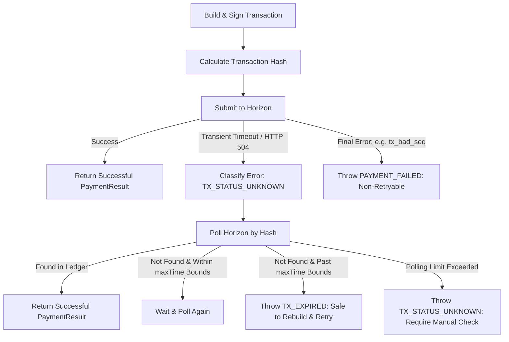

# Idempotency Strategy for Transaction Submission

This guide explains the SDK's idempotency strategy for transaction submission, details the risks of blind retries, and demonstrates how to safely handle network timeouts and transient failures.

---

## The Problem: Uncertain Submission Outcomes

When submitting a signed transaction to the Stellar network, a network drop, timeout (e.g., HTTP 504 Gateway Timeout), or transient server issue (e.g., HTTP 503) might occur. 

In these cases, **the transaction status is unknown**. The transaction may have reached the Stellar validators and successfully executed, or it may have been dropped entirely. 

If the client application blindly rebuilds and signs a new transaction (or retries the exact same transaction after it expires), it risks:
1.  **Double spending** (making duplicate payments) if the original transaction actually succeeded.
2.  **Unnecessary fees** and sequence number confusion.

---

## The PocketPay Idempotency Strategy

To prevent duplicate submissions, the SDK implements an idempotency strategy based on **Transaction Hash Tracking**, **Status Polling**, and **Timebounds enforcement**.



### 1. Error Classification & Metadata
Every submission failure is analyzed and categorized via `classifySubmitError`. Enriched metadata is attached to the thrown `PocketPayError`:
*   `transactionHash`: The unique SHA-256 hash of the submitted transaction envelope.
*   `retryable`: A boolean flag indicating if it is safe to submit the exact same transaction envelope again without checking status (e.g., on rate limits).
*   `code`: Custom error codes representing the failure mode:
    *   `TX_STATUS_UNKNOWN`: The status is unknown due to a gateway timeout. **Do not retry blindly.**
    *   `PAYMENT_FAILED`: The transaction was rejected on-chain (e.g., `tx_bad_auth`, `tx_insufficient_balance`). Non-retryable.

### 2. Timebounds Check
Every transaction should have a `maxTime` bound (set automatically by `setTimeout` during building). 
*   If a submission times out, the SDK polls the network for the transaction hash.
*   If the transaction is not found, polling continues.
*   If the local system time exceeds the transaction's `maxTime` bound and the transaction is still not found on-chain, we are guaranteed that the transaction has expired and can **never** be accepted by validators. It is now safe to rebuild the transaction with a new sequence number and retry.

### 3. Automated & Manual Polling
The SDK provides:
*   `submitTransactionIdempotently`: Automatically submits the transaction and handles transient timeouts by polling until confirmation or transaction expiry.
*   `pollTransactionStatus`: A helper to query the transaction status manually when an unknown status error is caught.

---

## API Reference

### `submitTransactionIdempotently`
Submits a transaction. If a network timeout or unknown status error occurs, it polls Horizon for confirmation until `maxTime` or `maxPollAttempts` is reached.

```typescript
import { submitTransactionIdempotently, getHorizonServer } from '@axionvera/pocketpay-sdk';

const server = getHorizonServer();
const result = await submitTransactionIdempotently(transaction, {
  maxPollAttempts: 10,
  pollIntervalMs: 2000
});
```

### `pollTransactionStatus`
Manually queries Horizon for a transaction's status by hash until it is confirmed or its `maxTime` bounds expire.

```typescript
import { pollTransactionStatus } from '@axionvera/pocketpay-sdk';

const result = await pollTransactionStatus(transaction, {
  maxPollAttempts: 5,
  pollIntervalMs: 1000
});
```

---

## Consumer Implementation Guide

Here is the recommended pattern for consumers submitting transactions:

### Option A: Using `submitTransactionIdempotently` (Recommended)
This approach handles submission and polling automatically.

```typescript
import { sendXLM, PocketPayError } from '@axionvera/pocketpay-sdk';

try {
  const result = await sendXLM({
    sourceSecret: 'S...',
    destination: 'G...',
    amount: '10.0',
    memo: 'Order #9021'
  });
  console.log('Payment successful! Hash:', result.hash);
} catch (error) {
  if (error instanceof PocketPayError) {
    if (error.code === 'TX_STATUS_UNKNOWN') {
      console.error(`Transaction status remains unknown. Hash: ${error.transactionHash}. Check explorer before retrying.`);
    } else if (error.code === 'TX_EXPIRED') {
      console.log('Transaction expired and never executed. Rebuilding and retrying is safe.');
      // Rebuild and retry payment...
    } else {
      console.error(`Submission failed: ${error.code} - ${error.message}`);
    }
  }
}
```

### Option B: Manual Error Classification & Polling
If you build and submit transactions manually, utilize `classifySubmitError` and `pollTransactionStatus`.

```typescript
import { 
  getHorizonServer, 
  classifySubmitError, 
  pollTransactionStatus 
} from '@axionvera/pocketpay-sdk';

const server = getHorizonServer();
const txHash = transaction.hash().toString('hex');

try {
  await server.submitTransaction(transaction);
  console.log('Submission succeeded!');
} catch (error) {
  const classified = classifySubmitError(error, txHash);

  if (classified.code === 'TX_STATUS_UNKNOWN') {
    console.warn(`Submission timed out. Polling status for hash: ${txHash}...`);
    try {
      const txRecord = await pollTransactionStatus(transaction, {
        maxPollAttempts: 15,
        pollIntervalMs: 2000
      });
      console.log('Confirmed via polling! Ledger:', txRecord.ledger);
    } catch (pollError) {
      // If pollTransactionStatus throws TX_EXPIRED, it is safe to rebuild & resubmit
      if (pollError.code === 'TX_EXPIRED') {
        console.error('Transaction expired. Re-building transaction is safe.');
      } else {
        console.error('Failed to confirm transaction status. DO NOT retry.');
      }
    }
  } else {
    console.error('Non-retryable submission error:', classified.message);
  }
}
```
