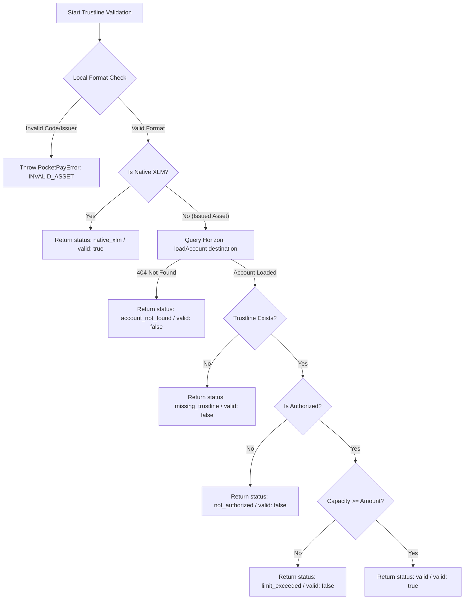

# Trustline Validation Guide — Issued Asset Payments

This guide explains how the PocketPay SDK handles **trustline validation** for issued asset payments on the Stellar network.

---

## 1. Overview & Problem Statement

On the Stellar network:
* **Native XLM payments** require only that the recipient account exists on-chain and is funded.
* **Issued asset payments** (such as USDC, EURT, or custom project tokens) require that the recipient account has explicitly created a **trustline** (`ChangeTrust` operation) for the asset's specific code and issuer public key.

Attempting to send an issued asset to a destination without a valid, authorized, and sufficient trustline causes transaction failure on Horizon with error codes like `op_no_destination`, `op_no_trust`, `op_not_authorized`, or `op_line_full`.

The PocketPay SDK provides pre-flight trustline validation helpers to detect these issues **before** building or submitting transactions to the network.

---

## 2. Destination Trustline Requirements

| Asset Type | Requirement | Verification Step |
| :--- | :--- | :--- |
| **Native XLM** | Account exists on-chain | Horizon 404 check |
| **Issued Asset (e.g. USDC)** | 1. Account exists on-chain<br>2. Trustline exists for `code` + `issuer`<br>3. Trustline is authorized by issuer<br>4. Remaining capacity (`limit - balance`) >= `amount` | Horizon account balance & trustline inspection |

---

## 3. Local Checks vs. Network Checks

Trustline verification uses a two-tiered design separating local formatting checks from network state checks:



### Local / Synchronous Checks (`validateAssetSpec`)
Performed offline without network calls:
* Asset code formatting (1–12 alphanumeric characters for credit assets).
* Asset issuer public key validation (`G...` format).
* Native XLM asset specification rule (`code: "XLM"` must not specify an issuer).

### Network / Asynchronous Checks (`checkDestinationTrustline`)
Queries Horizon server to inspect live ledger state:
* Recipient account existence check.
* Balance entry matching `asset_code` AND `asset_issuer`.
* Issuer authorization state (`is_authorized !== false`).
* Trustline limit capacity (`limit - currentBalance >= amount`).

---

## 4. Error, Warning & Recovery Taxonomy

When a trustline verification fails, `checkDestinationTrustline` returns a structured `TrustlineCheckResult` carrying a granular status discriminant, machine-readable error code, human message, and recovery hint:

| Status Discriminant | Machine Error Code | Meaning | Recovery Hint Action |
| :--- | :--- | :--- | :--- |
| `valid` | N/A | Destination is ready to receive payment | N/A |
| `native_xlm` | N/A | Native XLM payment (no trustline required) | N/A |
| `account_not_found` | `UNFUNDED_DESTINATION` | Recipient account is unfunded (404) | `fund_account` |
| `missing_trustline` | `MISSING_TRUSTLINE` | Recipient has no trustline for asset | `add_trustline` |
| `not_authorized` | `TRUSTLINE_NOT_AUTHORIZED` | Trustline pending issuer authorization | `authorize_trustline` |
| `limit_exceeded` | `TRUSTLINE_LIMIT_EXCEEDED` | Payment amount exceeds trustline limit | `increase_trustline_limit` |

---

## 5. Example Failure Scenarios & Usage Code

### Scenario A: Recipient Has No Trustline (`MISSING_TRUSTLINE`)

```ts
import { checkDestinationTrustline } from 'stellar-pocketpay-sdk';

const result = await checkDestinationTrustline(
  'GBRPYHIL2CI3FNQ4BXLFMNDLFJUNPU2HY3ZMFSHONUCEOASW7QC7OX2H',
  {
    code: 'USDC',
    issuer: 'GA5ZSEJYB37JRC5AVCIA5XYMGV65AUKZ726JL4Z6ZAL6S627B5XUN327',
  }
);

if (!result.valid) {
  console.log(result.status);    // 'missing_trustline'
  console.log(result.errorCode); // 'MISSING_TRUSTLINE'
  console.log(result.message);   // 'Destination account ... has no trustline for asset USDC:GA5ZSE...'
}
```

### Scenario B: Recipient Trustline Exceeds Capacity (`TRUSTLINE_LIMIT_EXCEEDED`)

```ts
const result = await checkDestinationTrustline(
  destinationPublicKey,
  { code: 'USDC', issuer: usdcIssuer },
  { amount: '500.0' } // Sender wants to send 500 USDC
);

if (!result.valid && result.status === 'limit_exceeded') {
  console.log('Current Balance:', result.currentBalance);     // e.g. '950.0000000'
  console.log('Trustline Limit:', result.limit);              // e.g. '1000.0000000'
  console.log('Available Capacity:', result.availableCapacity); // '50.0000000'
  // Show UI prompt: "Recipient can only accept up to 50 more USDC."
}
```

### Scenario C: Enforcing Pre-flight Check with `verifyPaymentTrustlineOrThrow`

```ts
import { verifyPaymentTrustlineOrThrow } from 'stellar-pocketpay-sdk';

try {
  await verifyPaymentTrustlineOrThrow(
    destinationPublicKey,
    { code: 'USDC', issuer: usdcIssuer },
    { amount: '100.0' }
  );
  // Proceed with issued asset payment submission...
} catch (error) {
  if (error instanceof PocketPayError) {
    console.error(`Trustline check failed [${error.code}]:`, error.message);
  }
}
```

---

## 6. Summary of Exports

All trustline types and functions are exported from the package root:

```ts
import {
  // Functions
  validateAssetSpec,
  checkDestinationTrustline,
  safeCheckDestinationTrustline,
  verifyPaymentTrustlineOrThrow,
  // Types
  StellarAssetSpec,
  TrustlineStatus,
  TrustlineCheckResult,
  TrustlineCheckOptions,
} from 'stellar-pocketpay-sdk';
```

---

## 7. Using Trustlines with `sendAsset`

The `sendAsset` helper combines trustline validation and payment submission in
one call. For issued assets it automatically runs a pre-flight
`checkDestinationTrustline` before building or signing any transaction, so you
do not need to call the check helpers manually unless you want the status detail
in your UI:

```ts
import { sendAsset, safeSendAsset, PocketPayError } from 'stellar-pocketpay-sdk';

// Sending an issued asset — trustline check runs automatically
const result = await sendAsset({
  sourceSecret: senderSecretKey,
  destination: receiverPublicKey,
  amount: '50',
  asset: { code: 'USDC', issuer: usdcIssuerPublicKey },
  memo: 'invoice #42',
});

// Non-throwing variant
const safe = await safeSendAsset({
  sourceSecret: senderSecretKey,
  destination: receiverPublicKey,
  amount: '50',
  asset: { code: 'USDC', issuer: usdcIssuerPublicKey },
});

if (!safe.ok) {
  const err = safe.error;
  // Common codes: MISSING_TRUSTLINE, TRUSTLINE_NOT_AUTHORIZED,
  // TRUSTLINE_LIMIT_EXCEEDED, ACCOUNT_NOT_FOUND, INVALID_ASSET
  console.error(err.code, err.message);
}
```

To skip the pre-flight check (for example when you know the trustline is valid
and want to avoid the extra Horizon round-trip):

```ts
await sendAsset({
  sourceSecret: senderSecretKey,
  destination: receiverPublicKey,
  amount: '50',
  asset: { code: 'USDC', issuer: usdcIssuerPublicKey },
  skipTrustlineCheck: true, // skips checkDestinationTrustline
});
```

> **See also:** [Issued Asset Payments Guide](./issued-asset-payments.md) for
> the full lifecycle including `ChangeTrust` setup, the complete payment flow,
> error reference, and native XLM compatibility.
